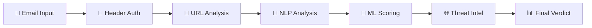

<p align="center">
  
</p>

<h1 align="center">🛡️ PhishGuard SOC</h1>
<h3 align="center">Intelligent Phishing Detection Platform</h3>

<p align="center">
  
  
  
  
  
</p>

<p align="center">
  <b>A production-grade Security Operations Center (SOC) dashboard that combines rule-based analysis, machine learning, NLP behavioral detection, and threat intelligence to identify and classify phishing emails in real time.</b>
</p>

---

## 📋 Overview

Phishing remains the **#1 attack vector** in cybersecurity, responsible for over 90% of data breaches. PhishGuard SOC is an end-to-end phishing detection platform that goes beyond simple keyword matching — it applies a **layered detection pipeline** combining email authentication analysis, URL intelligence, NLP behavioral profiling, and machine learning classification to produce a comprehensive threat assessment.

### Who is this for?

- **Security analysts** who need a fast email triage tool  
- **SOC teams** looking for an automated first-pass phishing filter  
- **Cybersecurity students & researchers** building portfolio projects  
- **Organizations** wanting a self-hosted, privacy-first email scanner  

---

## ✨ Features

| Category | Capability |
|----------|-----------|
| 📧 **Email Parsing** | Parse `.eml` files — extract headers, body (text/HTML), metadata |
| 🔐 **Authentication Analysis** | SPF verification, DKIM signature detection, Return-Path mismatch, display-name spoofing |
| 🔗 **URL Intelligence** | Extract links, detect shortened URLs, flag suspicious TLDs, domain age heuristics |
| 🧠 **NLP Behavioral Analysis** | Urgency/fear/authority keyword detection, imperative language, sentiment analysis |
| 🤖 **ML Phishing Detection** | RandomForest classifier with 15-feature vector, phishing probability score (0–100%) |
| 📡 **Real-Time Gmail Monitoring** | OAuth2 Gmail API integration with threaded inbox polling |
| 🌐 **Threat Intelligence** | WHOIS domain lookup, domain age detection, VirusTotal URL reputation |
| 🎯 **Attack Classification** | Classify attacks: Credential Harvesting, BEC, Malware Delivery, Invoice Scam |
| ⚠️ **Alerting** | Dashboard notifications, email alerts (SMTP), Telegram bot integration |
| 📊 **SOC Dashboard** | Dark-themed Streamlit UI with Plotly gauges, glassmorphism cards, and signal breakdowns |
| 📄 **Security Reports** | Export analysis as JSON or professionally formatted PDF reports |
| 🛡️ **Privacy** | Email address masking and SHA-256 content hashing |

---

## 🏗️ Architecture

PhishGuard SOC follows a **layered architecture** designed for modularity, extensibility, and clear separation of concerns:

```
┌──────────────────────────────────────────────────────┐
│                  📊 SOC DASHBOARD                     │
│         (Streamlit · Plotly · Glassmorphism)          │
├──────────────────────────────────────────────────────┤
│              ⚠️ ALERT & RESPONSE LAYER                │
│       (Dashboard · Email · Telegram Alerts)          │
├──────────────────────────────────────────────────────┤
│             🌐 THREAT INTELLIGENCE LAYER              │
│          (WHOIS · VirusTotal · Attack Type)           │
├──────────────────────────────────────────────────────┤
│            🤖 MACHINE LEARNING LAYER                  │
│   (RandomForest · Feature Extraction · Scoring)      │
├──────────────────────────────────────────────────────┤
│             🔍 DETECTION ENGINE LAYER                 │
│  (Header Auth · URL Analysis · NLP · Risk Engine)    │
├──────────────────────────────────────────────────────┤
│              📥 DATA INGESTION LAYER                  │
│          (.eml Upload · Gmail API Monitor)            │
└──────────────────────────────────────────────────────┘
```

Each layer operates independently and communicates through well-defined data contracts (Python dicts), making it straightforward to swap components or add new detection modules.

---

## 🔍 Detection Pipeline

Every email passes through a **6-stage detection pipeline**:



| Stage | Module | What It Does |
|-------|--------|-------------|
| **1. Email Parsing** | `parser/eml_parser.py` | Extracts headers, text body, and HTML body from `.eml` files |
| **2. Header Authentication** | `parser/header_auth.py` | Checks SPF, DKIM, Return-Path mismatch, display-name spoofing |
| **3. URL Analysis** | `url_analysis/` | Extracts URLs, detects shortened links, suspicious TLDs, new domains |
| **4. NLP Analysis** | `nlp_analysis/` | Scores urgency, fear, authority keywords; sentiment polarity analysis |
| **5. ML Scoring** | `ml_detection/` | RandomForest classifier producing phishing probability (0–1.0) |
| **6. Threat Intelligence** | `threat_intelligence/` | WHOIS domain age, VirusTotal reputation, attack type classification |

The pipeline produces a **combined risk score** (0–100) blending rule-based scoring (60%) with ML probability (40%).

---

## 📸 Screenshots

<p align="center">
  <i>📧 Email Threat Analysis — Upload an .eml file for instant analysis</i>
</p>

> 🖼️ `[Dashboard screenshot — Upload view with file uploader and dark theme]`

<p align="center">
  <i>📊 Risk Assessment — Plotly gauge, threat level badge, and ML confidence bar</i>
</p>

> 🖼️ `[Dashboard screenshot — Risk gauge, signal breakdown cards, and threat badge]`

<p align="center">
  <i>🔍 Signal Breakdown — Header, URL, and NLP signal cards with indicator pills</i>
</p>

> 🖼️ `[Dashboard screenshot — Three-column signal breakdown with glassmorphism cards]`

<p align="center">
  <i>📥 Reports — Download JSON and PDF security reports</i>
</p>

> 🖼️ `[Dashboard screenshot — Download report buttons and attack classification panel]`

---

## 📂 Project Structure

```
phishing_detection_system/
│
├── parser/                     # Email parsing & header authentication
│   ├── eml_parser.py
│   └── header_auth.py
│
├── url_analysis/               # URL extraction & domain analysis
│   ├── url_extractor.py
│   └── domain_analysis.py
│
├── nlp_analysis/               # NLP tone & sentiment analysis
│   ├── tone_analyzer.py
│   └── sentiment_engine.py
│
├── scoring/                    # Rule-based risk scoring engine
│   └── risk_engine.py
│
├── ml_detection/               # Machine learning phishing classifier
│   ├── feature_extractor.py
│   ├── phishing_classifier.py
│   └── model_loader.py
│
├── threat_intelligence/        # WHOIS, VirusTotal, attack classification
│   ├── whois_lookup.py
│   ├── virustotal_lookup.py
│   └── attack_classifier.py
│
├── ingestion/                  # Gmail API integration
│   ├── email_fetcher.py
│   └── gmail_monitor.py
│
├── alerts/                     # Alert generation & notifications
│   ├── alert_generator.py
│   └── notification_service.py
│
├── reports/                    # JSON & PDF report generation
│   └── report_generator.py
│
├── privacy/                    # Content hashing & email masking
│   └── content_hashing.py
│
├── dashboard/                  # Analysis pipeline orchestrator
│   └── pipeline.py
│
├── ui/                         # Streamlit SOC dashboard
│   └── app.py
│
├── assets/                     # Images & static files
├── requirements.txt
└── README.md
```

---

## 🛠️ Technologies

| Technology | Purpose |
|-----------|---------|
| **Python 3.11+** | Core language |
| **Streamlit** | Interactive SOC dashboard |
| **Scikit-learn** | RandomForest phishing classifier |
| **TextBlob** | Sentiment analysis |
| **NLTK** | Natural language processing |
| **Plotly** | Interactive risk gauge & charts |
| **tldextract** | Domain parsing & TLD analysis |
| **python-whois** | WHOIS domain intelligence |
| **Requests** | VirusTotal API integration |
| **fpdf2** | PDF report generation |
| **Gmail API** | Real-time inbox monitoring |
| **Joblib** | ML model persistence |

---

## 🚀 Installation

### Prerequisites

- Python 3.11 or higher
- pip package manager
- Git

### Step-by-step Setup

```bash
# 1. Clone the repository
git clone https://github.com/yourusername/phishing_detection_system.git
cd phishing_detection_system

# 2. Create a virtual environment (recommended)
python -m venv venv

# Windows
venv\Scripts\activate

# macOS/Linux
source venv/bin/activate

# 3. Install dependencies
pip install -r requirements.txt

# 4. Download NLTK data (first-time only)
python -c "import nltk; nltk.download('punkt')"
```

### Optional: Configure API Keys

```bash
# VirusTotal (for URL reputation checks)
set VIRUSTOTAL_API_KEY=your_api_key_here        # Windows
export VIRUSTOTAL_API_KEY=your_api_key_here      # macOS/Linux

# Gmail API (for inbox monitoring)
# Place your credentials.json in the project root
# See: https://developers.google.com/gmail/api/quickstart/python
```

---

## ▶️ Usage

### Launch the Dashboard

```bash
streamlit run ui/app.py
```

The dashboard opens at **http://localhost:8501**.

### Analyze an Email

1. Navigate to **📧 Upload Email** in the sidebar  
2. Drag and drop an `.eml` file (or click Browse)  
3. View the full threat assessment: risk score, signal breakdown, attack classification, and recommendations  
4. Download a **JSON** or **PDF** security report  

### Connect Gmail (Optional)

1. Navigate to **📡 Connect Gmail**  
2. Upload your `credentials.json` from the Google Cloud Console  
3. Click **Connect & Start Monitoring**  
4. New emails are automatically analyzed in the background  

### Configure Settings

- Navigate to **⚙️ Settings** to add your VirusTotal API key, Telegram bot token, or SMTP credentials for email alerts  

---

## 🧪 Testing

```bash
# Run the risk-scoring scenario tests
python test_risk_scenarios.py

# Run the full pipeline integration test
python test_integration.py
```

---

## 🔮 Future Improvements

| Enhancement | Description |
|------------|-------------|
| 📱 **Mobile Alerts** | Push notifications via Firebase for real-time mobile alerts |
| 🌐 **Browser Extension** | Chrome/Firefox extension to scan emails directly in webmail |
| 🏢 **Enterprise Gateway** | Integration with enterprise email gateways (Exchange, Postfix) |
| 🧠 **Deep Learning** | Transformer-based models (BERT) for advanced text classification |
| 📈 **Threat Dashboard Analytics** | Historical trend analysis, threat heatmaps, and geo-location mapping |
| 🔄 **Feedback Loop** | User feedback to retrain and improve ML models over time |
| 🐳 **Docker Deployment** | Containerized deployment with Docker Compose |

---

## 🤝 Contributing

Contributions are welcome! Please open an issue or submit a pull request.

1. Fork the repository  
2. Create a feature branch (`git checkout -b feature/amazing-feature`)  
3. Commit your changes (`git commit -m 'Add amazing feature'`)  
4. Push to the branch (`git push origin feature/amazing-feature`)  
5. Open a Pull Request  

---

## 📄 License

This project is licensed under the **MIT License** — see the [LICENSE](LICENSE) file for details.

---

<p align="center">
  <b>Built with ❤️ for cybersecurity professionals</b><br>
  <sub>PhishGuard SOC v2.0 — Intelligent Phishing Detection Platform</sub>
</p>
